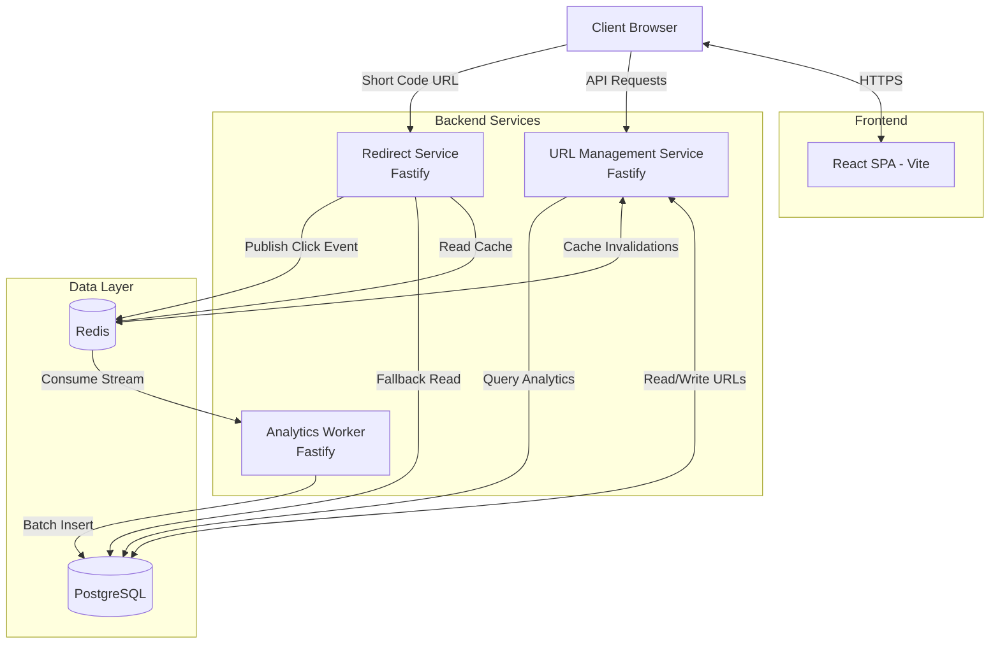
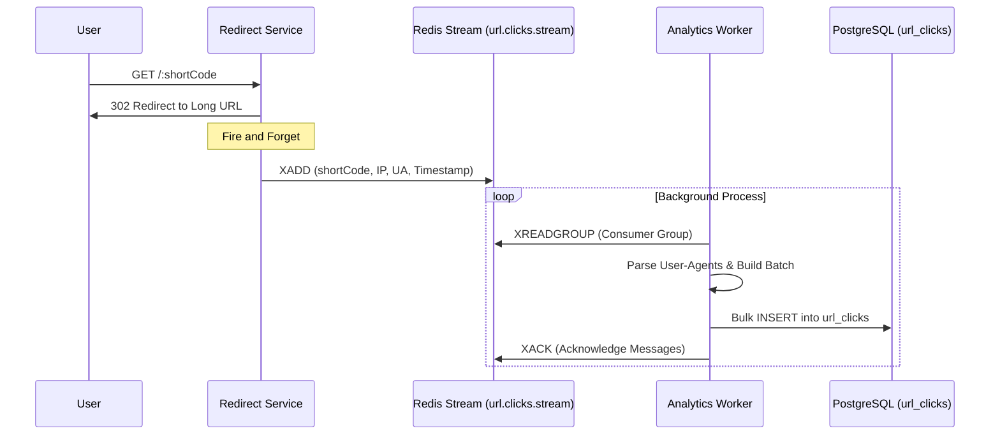

# FastUrl High-Level Design (HLD)

This document outlines the high-level architecture and design decisions for the FastUrl project, derived directly from the actual source code implementation and repository structure.

## 1. System Architecture

FastUrl utilizes a microservices architecture on the backend alongside a modern monolithic React frontend.

### Architecture Diagram

## 2. Major Components

### 2.1 Frontend Application (`/frontend`)
- **Technology Stack:** React 19, React Router v7, Recharts, Vite, Tailwind/Vanilla CSS.
- **Responsibility:** Provides the user interface for authenticating, managing URLs, and visualizing traffic data.
- **Key Modules:**
  - **`ThemeContext`**: Manages the application-wide dark/light mode state dynamically using CSS variables.
  - **`AuthContext`**: Handles user sessions and synchronization with the backend.
  - **Analytics Dashboards**: Utilizes `recharts` to render time-series line charts and categorical bar charts.

### 2.2 URL Management Service (`/backend/services/url-management-service`)
- **Technology Stack:** Node.js, Fastify, TypeScript, `better-auth`.
- **Responsibility:** The core API for the frontend. Handles CRUD operations for URLs, user authentication, and serving aggregated analytics data.
- **Interactions:**
  - Validates and stores user URLs in **PostgreSQL**.
  - Invalidates and updates the **Redis Cache** when URLs are modified or deleted to ensure the Redirect Service serves fresh data.
  - Queries the `url_clicks` table in PostgreSQL to serve time-series and summary data back to the frontend analytics dashboard.

### 2.3 Redirect Service (`/backend/services/redirect-service`)
- **Technology Stack:** Node.js, Fastify, `ioredis`.
- **Responsibility:** Resolves short codes to their original long URLs with the absolute lowest possible latency.
- **Interactions:**
  - Attempts to resolve short codes via the **Redis** cache first (Cache-aside pattern).
  - If a cache miss occurs, falls back to **PostgreSQL** and populates the cache.
  - Constructs a raw click event containing the IP, User-Agent, Referrer, and Timestamp, and publishes it asynchronously to a **Redis Stream** (`url.clicks.stream`).

### 2.4 Analytics Service (`/backend/services/analytics-service`)
- **Technology Stack:** Node.js, `ua-parser-js`, Redis Consumer Groups.
- **Responsibility:** A background worker process that asynchronously processes incoming click events to prevent blocking the redirect path.
- **Interactions:**
  - Acts as a long-running stream consumer listening to the `url.clicks.stream` in Redis.
  - Parses raw `User-Agent` strings into structured OS, browser, and device types.
  - Batches multiple click events together and performs a bulk `INSERT` into the `url_clicks` table in **PostgreSQL**.

## 3. Key Data Flows

### 3.1 Asynchronous Analytics Pipeline

To ensure that tracking analytics does not add latency to the core URL redirection feature, FastUrl implements an event-driven architecture using Redis Streams.

## 4. Design Decisions & Trade-offs

### Pros
1. **Extremely Low Latency Redirections:** By entirely decoupling the analytics processing into an asynchronous background job using a Redis Stream, the redirect service operates with near-zero overhead. The user receives a 302 redirect immediately.
2. **Independent Scalability:** The architecture separates read-heavy operations (redirections) from write-heavy operations (analytics logging). The `redirect-service` and `analytics-service` can be horizontally scaled independently based on system load.
3. **Fault Tolerance and Resiliency:** Redis Consumer Groups guarantee that if the analytics worker crashes, unprocessed click events remain safely in the stream. Upon restart, the worker reclaims pending messages via `XAUTOCLAIM`, ensuring no data loss.
4. **Database Optimization:** The Analytics Service batches inserts rather than writing single rows. This significantly reduces connection overhead and transaction load on the PostgreSQL database.

### Cons
1. **Eventual Consistency in Analytics:** Because clicks are processed asynchronously, there is a slight, temporary delay between a user clicking a link and that event appearing on the creator's analytics dashboard.
2. **Operational Complexity:** Managing a multi-service architecture, Redis Streams, Consumer Groups, and shared databases introduces significantly more deployment, monitoring, and debugging complexity compared to a traditional monolithic application.
3. **Analytics Read Bottleneck at Scale:** Currently, the `url-management-service` runs live aggregation queries directly against the `url_clicks` Postgres table (e.g., `COUNT(*)`, `GROUP BY`). As the dataset grows to millions of rows, these queries will become slow unless mitigated by materialized views, pre-aggregated rollup tables, or a dedicated OLAP database (like ClickHouse).
