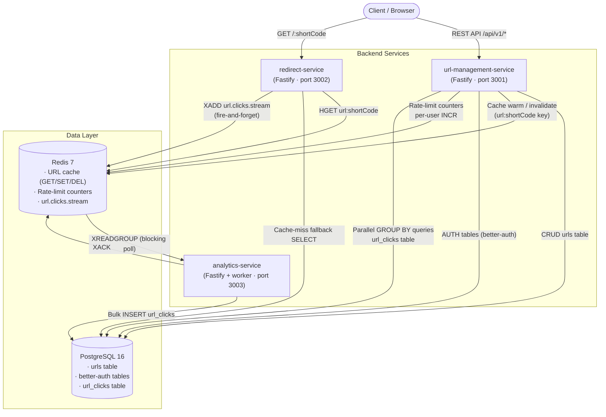
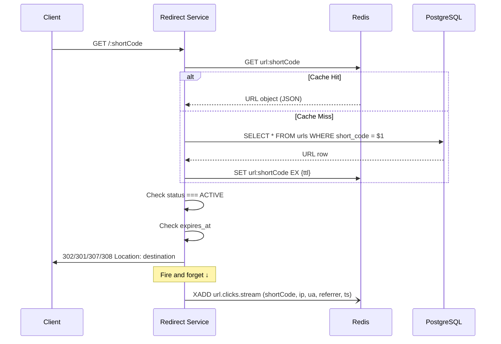
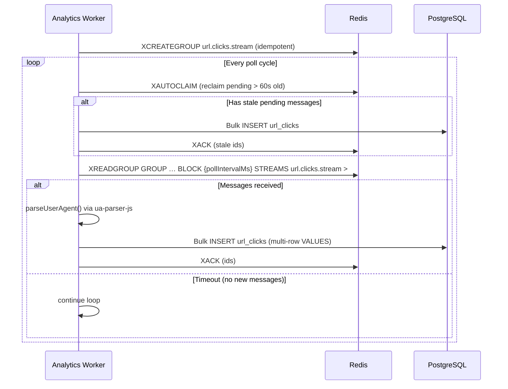

# FastUrl — Backend High-Level Design (HLD)

This document describes the high-level architecture and key design decisions for the FastUrl backend, derived directly from the source code in `/backend/services/`.

---

## 1. System Overview

The backend is split into **three independent Node.js services**, each with a distinct responsibility. They share a single PostgreSQL database and a single Redis instance but are deployed and scaled independently.

| Service | Package name | Primary role |
|---|---|---|
| `url-management-service` | `@fasturl/url-management-service` | REST API — CRUD, auth, analytics read-path |
| `redirect-service` | `@fasturl/redirect-service` | Ultra-low-latency URL resolution & click publishing |
| `analytics-service` | `@fasturl/analytics-service` | Background worker — click event processing |

---

## 2. High-Level Architecture Diagram



---

## 3. Service Deep-Dives

### 3.1 `url-management-service`

**Responsibility:** The primary API consumed by the frontend. Handles all URL lifecycle operations, user authentication, and serves aggregated analytics data.

#### Internal Architecture (Clean Architecture)

Each service follows a layered architecture that mirrors Clean Architecture / Hexagonal principles:

```
src/
├── application/       ← Use-case classes (CreateUrl, GetUrl, UpdateUrl, DeleteUrl, ListUrls)
├── domain/
│   ├── entities/      ← Url entity + types (UrlStatus, RedirectType)
│   ├── interfaces/    ← UrlRepository, Cache (abstractions)
│   └── services/      ← base62 encoder, validateDestination (pure domain logic)
├── infrastructure/
│   ├── postgres/      ← PostgresUrlRepository, ensureSchema, connection pool
│   ├── redis/         ← RedisCache (get/set/delete wrapper over ioredis)
│   └── auth/          ← better-auth setup (email+password + bearer plugin)
└── interfaces/
    └── http/
        ├── middleware/ ← requireAuth, per-user create-URL rate limiter
        └── routes/    ← url.routes.ts, auth.routes.ts, me.routes.ts, analytics.routes.ts
```

#### REST API Surface

| Method | Path | Auth | Notes |
|---|---|---|---|
| `POST/GET` | `/api/auth/*` | — | Proxied to `better-auth` handler; stricter 10 req/min rate limit |
| `GET` | `/me` | ✓ | Returns current user identity |
| `POST` | `/api/v1/urls` | ✓ | Create URL; **30 req/min per user** (Redis INCR counter) |
| `GET` | `/api/v1/urls` | ✓ | List URLs (pagination via `limit` / `offset`) |
| `GET` | `/api/v1/urls/:shortCode` | ✓ | Fetch single URL (ownership enforced) |
| `PATCH` | `/api/v1/urls/:shortCode` | ✓ | Update destination / status / expiry |
| `DELETE` | `/api/v1/urls/:shortCode` | ✓ | Hard delete; invalidates Redis cache |
| `GET` | `/api/v1/urls/:shortCode/analytics/summary` | ✓ | Aggregated click stats |
| `GET` | `/api/v1/urls/:shortCode/analytics/timeseries?range=` | ✓ | Time-bucketed click chart (24h / 7d / 30d) |
| `GET` | `/healthz` | — | Health check |

#### Middleware Stack (applied in order)

1. `@fastify/helmet` — security headers
2. `@fastify/cors` — CORS with allowed origins from config
3. `@fastify/rate-limit` (global) — 300 req/min per IP, backed by Redis
4. `requireAuth` (per-route) — validates `better-auth` bearer session
5. `createUrlRateLimit` (POST `/api/v1/urls` only) — per-user 30 req/min using a Redis `INCR` + `EXPIRE` pattern

#### Short Code Generation

When a custom alias is not provided, the service generates a random short code using a cryptographically random 6-byte integer encoded in **Base62** (`[0-9A-Za-z]`). Up to 5 attempts are made; if all 5 collide with existing codes the request fails with `SHORT_CODE_GENERATION_FAILED` (503).

```
randomBytes(6) → 48-bit uint → base62Encode() → short code (e.g. "aB3xZ9")
```

Custom aliases must match `/^[A-Za-z0-9_-]{1,16}$/` and are checked for uniqueness before being saved.

#### Authentication — `better-auth`

Authentication is managed by the `better-auth` library (v1.4.22). The service proxies all `/api/auth/*` requests to `better-auth`'s Fetch-API handler. It uses:
- **Email + password** strategy
- **Bearer plugin** — allows clients to pass a `Bearer <token>` in the `Authorization` header
- PostgreSQL as the session/user store (manages its own `user`, `session`, `account` tables)

The `requireAuth` middleware calls `auth.api.getSession()` and injects the resolved user onto `request.user`.

Password policy is enforced at the route level before delegating to `better-auth`: the password must contain at least one uppercase, lowercase, digit, and special character.

#### Analytics Read-Path — Two Pool Pattern

The analytics routes use **two separate `pg.Pool` instances**:
- `urlPool` — used only to verify URL ownership (a fast `SELECT 1 FROM urls WHERE ...`)
- `analyticsPool` — executes the heavy aggregation queries against `url_clicks`

This intentional isolation prevents analytic queries from starving the URL management connection pool under high read load. Both pools point to the same PostgreSQL database.

The analytics routes run **parallel aggregations** via `Promise.all`:
- Total click count
- Top 10 referrers
- Top 10 operating systems
- Top 10 browsers
- Device type breakdown
- Top 10 countries (resolved from click IP via `geoip-lite`)

Time-series queries use PostgreSQL's `date_trunc()` to bucket clicks into hours (24h range) or days (7d / 30d range).

---

### 3.2 `redirect-service`

**Responsibility:** Resolves a short code to its destination URL as fast as possible and immediately returns a redirect. Click event publishing is **fire-and-forget**.

#### Internal Architecture

```
src/
├── application/   ← ResolveShortCode use case
├── domain/
│   ├── entities/  ← Url entity
│   └── interfaces/← Cache, UrlRepository, EventPublisher (abstractions)
├── infrastructure/
│   ├── postgres/  ← PostgresUrlRepository (read-only: findByShortCode)
│   └── redis/
│       ├── RedisCache.ts          ← get/set with TTL
│       └── RedisEventPublisher.ts ← XADD to url.clicks.stream
└── interfaces/http/routes/
    └── redirect.routes.ts ← single GET /:shortCode handler
```

#### Resolution Flow (Cache-Aside Pattern)



Key behaviours:
- Cache key format: `url:<shortCode>`, stored as JSON-serialised `Url` entity
- After resolving, the service checks `status === "ACTIVE"` and `expires_at` before issuing the redirect
- The redirect HTTP status code (`301 / 302 / 307 / 308`) comes from the `redirect_type` column stored per-URL — this lets creators choose between browser-cached (301) and non-cached (302/307) redirects
- The `XADD` call publishes to `url.clicks.stream` with `MAXLEN ~ 1_000_000` to prevent unbounded stream growth
- The redirect service has **no CORS middleware** — it only serves redirects, not JSON APIs

---

### 3.3 `analytics-service`

**Responsibility:** A long-running background worker that drains the `url.clicks.stream` Redis Stream, parses user agents, and bulk-inserts events into `url_clicks`.

#### Architecture

```
src/
├── config/           ← stream key, group name, consumer name, batch size, poll interval
├── infrastructure/
│   └── postgres/
│       ├── pool.ts         ← pg.Pool
│       ├── ensureSchema.ts ← CREATE TABLE IF NOT EXISTS url_clicks (…)
│       └── AnalyticsRepository.ts
└── workers/
    └── clickConsumer.ts ← the entire consumer loop
```

The service also runs a minimal Fastify HTTP server (healthz endpoint only) alongside the worker — this allows container orchestrators to health-check the process without the worker loop blocking startup.

#### Consumer Loop Detail



Key behaviours:
- **Consumer Group**: uses Redis Consumer Groups so multiple instances of the analytics service can run concurrently without double-processing
- **Crash recovery via `XAUTOCLAIM`**: at the start of each loop iteration, the worker claims any messages that have been pending (unacknowledged) for > 60 seconds. This ensures no click event is lost even if the process restarts mid-batch
- **Batch INSERT**: a single parameterised `INSERT INTO url_clicks (…) VALUES ($1,…), ($9,…)` statement is constructed for the entire batch, reducing PostgreSQL round-trips and transaction overhead
- **`ua-parser-js` + `geoip-lite` enrichment**: each raw event is enriched with structured `os`, `browser`, `deviceType`, and `country` fields before insertion. `geoip-lite` uses a bundled GeoIP database for synchronous, offline IP→ISO 3166-1 alpha-2 lookups — no external API calls, no MaxMind license required. Private/loopback IPs resolve to an empty string.
- **Error isolation**: errors in the consumer loop are caught, logged, and the loop retries after a 2-second delay — the process does not exit on transient failures

---

## 4. Data Model

### `urls` table (managed by `url-management-service`)

```sql
CREATE TABLE urls (
  id             BIGSERIAL PRIMARY KEY,
  short_code     VARCHAR(16)  NOT NULL UNIQUE,
  user_id        TEXT         NOT NULL REFERENCES "user"(id) ON DELETE CASCADE,
  destination    TEXT         NOT NULL,
  status         VARCHAR(20)  NOT NULL DEFAULT 'ACTIVE',   -- 'ACTIVE' | 'DISABLED'
  redirect_type  SMALLINT     NOT NULL DEFAULT 302,        -- 301 | 302 | 307 | 308
  click_count    BIGINT       NOT NULL DEFAULT 0,
  created_at     TIMESTAMPTZ  NOT NULL DEFAULT now(),
  expires_at     TIMESTAMPTZ
);

CREATE INDEX idx_urls_user_created ON urls (user_id, created_at DESC);
```

> **Note:** `click_count` is a denormalised counter on the `urls` table but is **not updated** by the analytics pipeline — actual click data lives in `url_clicks`. The counter exists for lightweight display; the analytics routes query `url_clicks` for accurate data.

### `url_clicks` table (managed by `analytics-service`)

```sql
CREATE TABLE url_clicks (
  id          BIGSERIAL    PRIMARY KEY,
  short_code  VARCHAR(16)  NOT NULL,
  clicked_at  TIMESTAMPTZ  NOT NULL DEFAULT now(),
  ip          TEXT         NOT NULL DEFAULT '',
  user_agent  TEXT         NOT NULL DEFAULT '',
  referrer    TEXT         NOT NULL DEFAULT '',
  -- Parsed and enriched by analytics-service
  country     VARCHAR(2)   NOT NULL DEFAULT '',  -- ISO 3166-1 alpha-2
  os          VARCHAR(64)  NOT NULL DEFAULT '',
  browser     VARCHAR(64)  NOT NULL DEFAULT '',
  device_type VARCHAR(32)  NOT NULL DEFAULT ''   -- 'mobile' | 'tablet' | 'desktop' | ''
);

-- Query-optimised indexes for the analytics aggregation endpoints
CREATE INDEX idx_clicks_short_code_at ON url_clicks (short_code, clicked_at DESC);
CREATE INDEX idx_clicks_country       ON url_clicks (short_code, country);
CREATE INDEX idx_clicks_os            ON url_clicks (short_code, os);
CREATE INDEX idx_clicks_browser       ON url_clicks (short_code, browser);
CREATE INDEX idx_clicks_device        ON url_clicks (short_code, device_type);
```

### Redis Key Space

| Key / Pattern | Type | Set by | Read by | Purpose |
|---|---|---|---|---|
| `url:<shortCode>` | String (JSON) | UMS (create/update), RS (cache-miss populate) | RS | URL resolution cache |
| `ratelimit:create-url:<userId>` | String (counter) | UMS | UMS | Per-user URL creation rate limit |
| `fasturl:ratelimit:*` | Hash (by @fastify/rate-limit) | UMS | UMS | Global IP-level rate limit |
| `url.clicks.stream` | Stream | RS (XADD) | AS (XREADGROUP) | Click event pipeline |

---

## 5. Key Design Decisions & Trade-offs

### ✅ What works well

1. **Fire-and-forget analytics pipeline keeps the redirect path lean.** The redirect service responds with a 302 before the `XADD` is even awaited — click recording adds zero latency to the user-visible redirect.

2. **Redis Consumer Groups provide at-least-once delivery with crash safety.** `XAUTOCLAIM` at the top of every loop iteration means that if the analytics process dies mid-batch, messages are reclaimed and re-processed on restart. No click event is silently dropped.

3. **Clean Architecture separation inside each service.** Domain logic (short code generation, URL validation, expiry checks) lives in pure classes with no framework dependencies. Infrastructure concerns (Postgres, Redis, Fastify) are injected via interfaces. This makes use-cases independently unit-testable (tests exist for `CreateUrl`, `ResolveShortCode`, and `base62`).

4. **Two Postgres pool pattern in analytics read-path.** Isolating the heavy `GROUP BY` / `COUNT(*)` queries to a dedicated pool prevents analytical traffic from starving the URL CRUD connection pool under load.

5. **Per-user rate limiting on URL creation.** Using a Redis `INCR` + `EXPIRE` counter (30 req / 60s per user) prevents any single account from flooding the database with short code generation attempts.

6. **`redirect_type` stored per-URL.** Creators can choose between HTTP 301 (browser-cached, no re-validation) and 302/307 (non-cached). This matters for analytics accuracy — 301 responses are cached by browsers and won't generate repeat clicks, so using 302 by default gives more complete tracking.

### ⚠️ Known limitations / future work

1. **`url_clicks` grows without bound.** There is no partitioning, archival, or TTL on the `url_clicks` table. As the dataset grows to tens of millions of rows, `COUNT(*) GROUP BY` queries will become slow. Mitigation options include: PostgreSQL table partitioning by month, pre-aggregated rollup tables updated by the analytics worker, or migrating analytics reads to a dedicated OLAP store (e.g., ClickHouse).

2. **Eventual consistency in analytics.** Because clicks are processed asynchronously, there is a brief window (the worker's poll interval) between a click occurring and it appearing on the creator's dashboard.

3. **Geo-IP accuracy is bounded by the bundled database.** `geoip-lite` ships a stripped-down MaxMind database that is updated periodically (via `npm update`). Country resolution is best-effort: accuracy is ~95% for IPv4 at the country level, IPv6 coverage is narrower, and private/loopback IPs (e.g. during local development) resolve to `''`. For higher accuracy or city-level resolution, replace with a live MaxMind GeoIP2 API call or a self-hosted mmdb file.

4. **Single Redis instance is a SPOF.** Both the URL cache and the click event stream depend on the same Redis. Redis Sentinel or Cluster would be needed for high availability in production.

5. **`url-management-service` serves both the CRUD API and the analytics read API.** As analytics query volume grows independently of CRUD traffic, splitting the analytics read-path into its own service (backed by a read replica or a separate OLAP store) would allow independent scaling.
